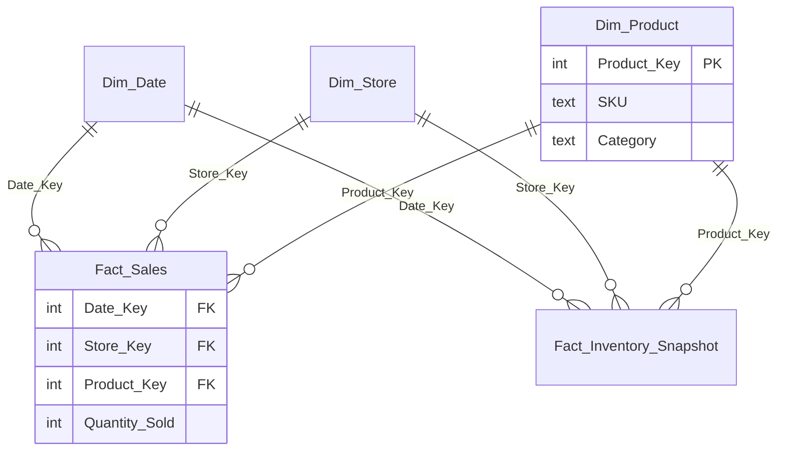

# 1 — Dimensional (Star-Schema) Modeling

**What it is.** Organize the data into *fact* tables (the measurable events — sales,
inventory) surrounded by *dimension* tables (the descriptive context — product, store,
date), joined on surrogate integer keys. This is Kimball-style dimensional modeling.

**Why I chose it.** The alternative — one wide, fully-denormalized table — is fast to
throw together but is a trap: it repeats descriptive text on every row, makes the grain
ambiguous, and turns every "by category / by month" question into a fragile string
operation. A star schema keeps each descriptor in exactly one place, makes the grain of
each fact explicit, and is what every BI tool (Power BI, Tableau) expects.

**What it looks like.**



Facts carry **only keys and measures** — no descriptive text — so a category rollup is a
clean join, not a `LIKE`:

```sql
SELECT p.Category, SUM(f.Sales_Amount) AS Revenue
FROM Fact_Sales f JOIN Dim_Product p ON f.Product_Key = p.Product_Key
GROUP BY p.Category;
```

**How I'd defend it.** "I used a star schema so the grain is explicit and every descriptor
lives in one dimension. It costs a join but buys correctness and BI-tool compatibility."
