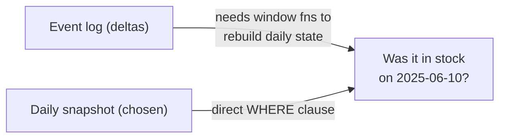

# 3 — Daily Snapshot Grain (a Deliberate Trade-off)

**What it is.** `Fact_Inventory_Snapshot` stores **one row per location/SKU/day** — a full
daily photo of on-hand quantity — rather than an event log that only records inventory
*changes* (a "transaction/delta" fact).

**Why I chose it.** An event-based design is more storage-efficient, but to answer "was this
SKU in stock at store 14 on this day?" you'd have to reconstruct point-in-time state with
window functions over the change history — easy to get subtly wrong, and slow. Given a solo,
time-boxed pilot, I traded storage for **query simplicity and reliability**: every KPI becomes
a direct `WHERE`/`GROUP BY`, with no state reconstruction. At this volume (~1.26M rows) the
storage cost is irrelevant.

**What it looks like.**



Detecting a stockout is then trivial and unambiguous:

```sql
SELECT * FROM Fact_Inventory_Snapshot WHERE Quantity_On_Hand = 0;
```

**How I'd defend it.** "Daily snapshot is the classic storage-for-simplicity trade. At 1.6M
rows storage is free, and it means my availability KPIs never depend on rebuilding state."
