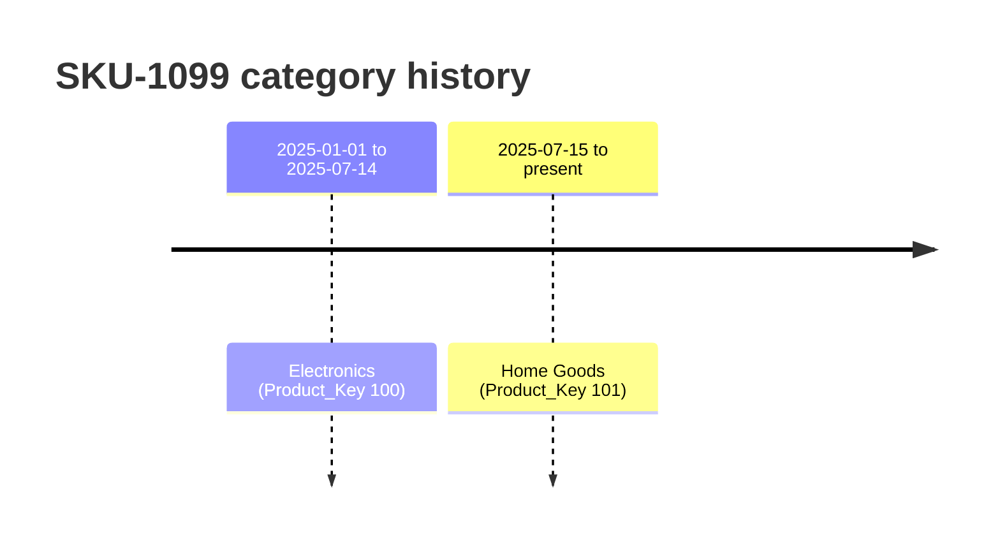

# 4 — Slowly Changing Dimension, Type 2

**What it is.** When a dimension attribute changes over time and you need history to stay
correct, SCD Type 2 keeps **multiple versioned rows** for the same business key, each with an
effective date range. Here it's applied to exactly one thing: a single SKU reclassified from
**Electronics → Home Goods** mid-year.

**Why I chose it.** The naive fix (just overwrite the category) is SCD Type 1 and would
*rewrite history*: January sales of that SKU would retroactively count as Home Goods. Type 2
preserves the truth — pre-reclassification facts stay Electronics, post stay Home Goods —
because each fact joins to the dimension **version effective on that fact's date**, not simply
the current one.

**What it looks like.** One SKU, two versions, two surrogate keys, non-overlapping windows:

| Product_Key | SKU | Category | Effective_Start | Effective_End | Is_Current |
|---|---|---|---|---|---|
| 100 | SKU-1099 | Electronics | 2025-01-01 | 2025-07-14 | 0 |
| 101 | SKU-1099 | Home Goods | 2025-07-15 | *(null)* | 1 |

The surrogate `Product_Key` is unique **per version**; `SKU` is the natural key shared across
versions. Facts already carry the date-correct `Product_Key` (resolved at load), so a validation
check confirms **0** fact rows are attached to the wrong-era version.

**How I'd defend it.** "SCD Type 2 on one attribute. Overwriting would rewrite history; instead
each fact joins to the version effective on its own date. It's a scoped practice exercise — it's
orthogonal to the core finding, and I'd say so rather than oversell it."
