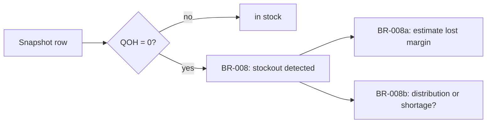

# 5 — Business-Rule Separation (Detect ≠ Cost ≠ Diagnose)

**What it is.** The "stockout" concept is split into **three independent business rules**
instead of one tangled definition:

| Rule | Question | Definition |
|---|---|---|
| **BR-008** | *Did* a stockout happen? | `Quantity_On_Hand = 0` — nothing else |
| **BR-008a** | What did it *cost*? | baseline in-stock sales rate × stockout days × unit margin |
| **BR-008b** | *Why* did it happen? | pooled inventory elsewhere → distribution vs. shortage |

**Why I chose it.** A tempting single definition — "a stockout is when we hit zero *while
demand exists*" — conflates detection with impact. It would **miss real stockouts** on
naturally low-traffic days and make the detection query depend on a harder analysis it doesn't
need. Separating the three means detection is simple and complete, costing is a distinct
estimate, and root-cause is a distinct classification — each independently testable.

**What it looks like.**

**How I'd defend it.** "Detection, cost, and root-cause are three rules, not one. If I'd baked
'demand exists' into detection, I'd undercount stockouts and couldn't falsify the hypothesis."
