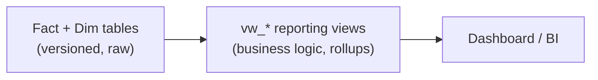

# 9 — Reporting / Semantic View Layer

**What it is.** A set of `vw_*` SQL views sit between the raw facts and the dashboard — one per
business question (in-stock rate, stockout classification, lost margin, revenue). The dashboard
and any BI tool read the **views**, never the raw tables.

**Why I chose it.** It separates *presentation* from *storage*. Business logic (the ≥3-unit
threshold, DC exclusion from store KPIs, the SKU rollup) lives in one auditable place, so a fix
happens once and propagates. It also let me solve a real presentation problem cleanly: the SCD2
SKU exists as two versioned rows in the facts, but a VP wants **one line** — so a rollup view
collapses it for reporting while the facts stay correctly versioned underneath.

**What it looks like.**

Key views: `vw_InStockRate`, `vw_StockoutClassification`, `vw_EstimatedLostMargin`
(+ `_BySKU` rollup), `vw_PilotRevenueSummary`, `vw_ProductReclassification`.

**How I'd defend it.** "The dashboard reads views, not tables, so business rules live in one
place. That's how the reclassified SKU can stay versioned in the facts but show as one clean
line to the VP."
