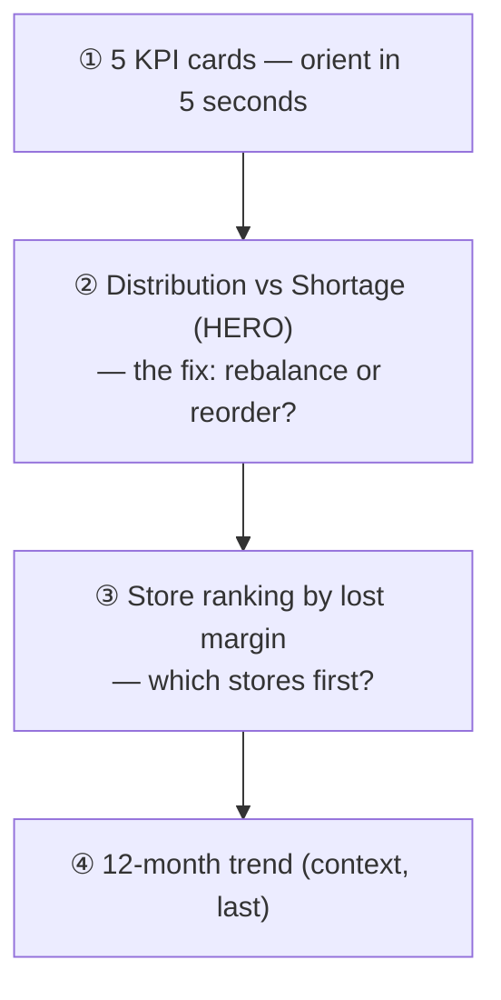

# 10 — Audience-Driven Dashboard Hierarchy

**What it is.** A single-page dashboard whose layout is ordered by the **decision-maker's
questions**, not by convention: KPI cards → **distribution-vs-shortage split (the hero)** →
store ranking → 12-month trend **last**.

**Why I chose it.** The generic template leads with a trend line. But the VP of Operations'
first questions are "*which stores are worst?*" and "*is this distribution or shortage?*" —
so the classification chart, the single most decision-relevant finding, is the hero, and the
trend (useful but not urgent) goes at the bottom. Layout is an analytical decision, not
decoration: it should answer the most actionable question first.

**What it looks like.**

**How I'd defend it.** "I deviated from the standard 'trend-first' layout on purpose. The
audience's first question is distribution-vs-shortage, so that's the hero; the trend is
supporting context, so it's last. The layout serves the decision."
